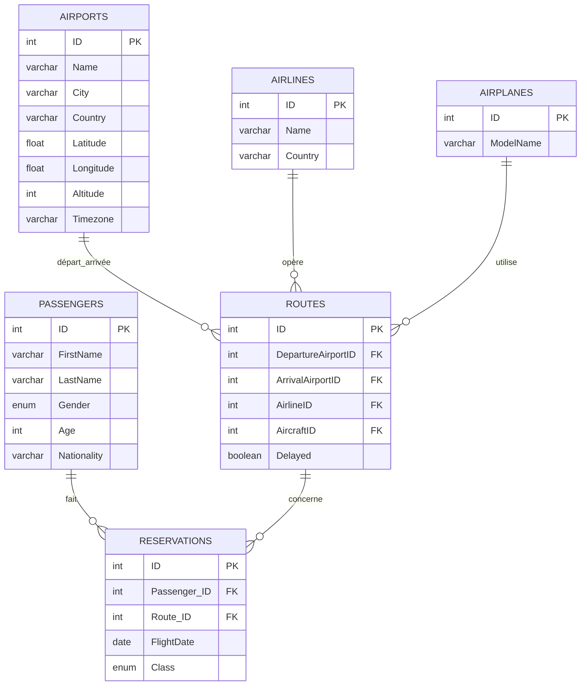

# Document de Conception de la Base de Données

## 1. Objectifs et Portée

Nous sommes une agence de consulting data spécialisée dans l'analyse des vols aériens. Ce projet vise à concevoir une base de données analytique sous MySQL afin de permettre à nos partenaires du secteur aérien :
- Optimiser leurs opérations
- Fidéliser des passagers
- Piloter leur stratégie en prenant des décisions basés sur des analyses fiables et exploitables.

### Création et Manipulation

Nous avons conçu un environnement complet autour de cette base :
- Collecte de données via Kaggle.
- Nettoyage et filitrage pour ne garder que les informations pertinentes à notre projet.
- Génération de données synthétiques pour relier plusieurs jeux de données de sources différentes.
- Modélisation normalisée (six tables en 3NF, c'est-à-dire que les tables sont structurées de manière à évtier les redondances et dépendances).
- Requêtes SQL pour démontrer des cas d'usage réels : vues, agrégations, segmentation clients etc...
- Analyse des résultats pour extraire des informations utiles à la prise de décision.
---
## 2. Sources des données et préparation

Nous utilisons deux jeux de données publics disponibles sur Kaggle :
1. Airline Dataset  
Contient des informations sur plus de 90 000 passagers fictifs (réduits à 2 000 pour notre projet).  
Auteur : Sourav Banerjee (https://www.kaggle.com/datasets/iamsouravbanerjee/airline-dataset)
2. Airports, Airlines, Planes & Routes [Update 2024]
Contient des vraies informations sur les vols, aéroports, avions et compagnies obtenues depuis OpenFlights.  
Auteur : Ahmad Rafiee (https://www.kaggle.com/datasets/ahmadrafiee/airports-airlines-planes-and-routes-update-2024?select=routes.csv)

### Etapes de Transformation
- Suppression de colonnes inutiles via Python (Pandas).
- Attribution des IDs pour chaque table
- Génération de deux nouvelles tables synthétiques : Reservations.csv et Routes.csv
- Application de filtres (2000 passagers, 2500 routes, 15000 réservations)
- Import des fichiers csv dans MySQL via LOAD DATA INFILE
---

## 3. Modèle Conceptuel et Schéma Relationnel
### 3.1 Entités et Attributs

| Table            | Attributs clés                                                         |
|------------------|-------------------------------------------------------------------------|
| **Passengers**   | `ID (PK)`, FirstName, LastName, Gender, Age, Nationality                |
| **Reservations** | `ID (PK)`, `Passenger_ID (FK)`, `Route_ID (FK)`, `FlightDate`, Class    |
| **Routes**       | `ID (PK)`, `DepartureAirportID (FK)`, `ArrivalAirportID (FK)`,  `AirlineID (FK)`, `AircraftID (FK)`, Delayed |
| **Airports**     | `ID (PK)`, Name, City, Country, Latitude, Longitude, Altitude, Timezone |
| **Airlines**     | `ID (PK)`, Name, Country                                               |
| **Airplanes**    | `ID (PK)`, ModelName                                                    |

(Class peut prendre trois valeurs possibles : Economic, Business et First) 

### 3.2 Diagramme ER (Mermaid)

## 4. Optimisations et Requêtes Avancées
La base de données permet les opérations suivantes :
- Vues SQL synthétiques (par destination, par passager, etc.)
- Opérations simples (aéroport les plus visités, retard par compagnie, etc.)
- Segmentation clients (passagers fréquents, type de classe, etc.)

# 5. Limitations et Evolutions Futures

### Limitations

- **Données synthétiques**  
  Les prénoms, routes ou nationalités ne sont pas réalistes ou cohérents

- **Manque de certaines dimensions**  
  Aucune donnée sur le personnel navigant ou la satisfaction client.
- **Pas de temps réel**  
  Pas de suivi live des vols ni mise à jour instantanée. Aucune pipeline pour alimentée notre base de donnée comme elle est fictive.

### Perspectives d’évolution

1. **Ingestion de logs de vol en temps réel**  
   Permettre le suivi du statut de chaque vol (en route, atterri, annulé).

2. **Trouvées de nouvelles tables**  
   Trouver une base de donnée sur le personnel et la satisfaction des passagers.

3. **Géocodage et altitude plus précis**  
   Ajouter des coordonnées 3D détaillées (latitude, longitude, altitude) pour des analyses de trajectoire.
