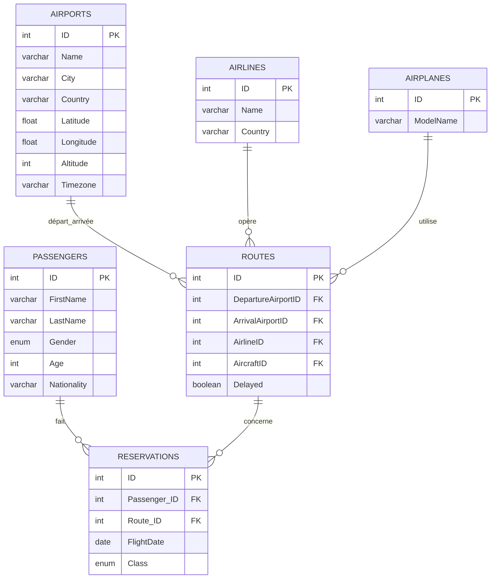

# Document de Conception de la Base de Données

# 1. Contexte et Objectifs

## Document de Conception de la Base de Données

## 1. Contexte et Objectifs

**Projet Final** – Nous considérons que nous somme une agence de consulting data spécialisé dans les vols aériens et nous développons une base de données MySQL pour réaliser des analyses.

- **Mission** : Aider nos compagnies aériennes partenaires à optimiser leurs opérations, améliorer l’expérience passager et piloter la stratégie métier à l’aide d’analyses fiables.  

> **Création et manipulation**  
> - Récupération de données sur plusieurs jeux de données disponible sur kaggle
> - Nettoyage de donnée pour garder les informations importantes
> - Génération de nouvelles données pour lier les deux jeux de données et faire une base de donnée cohérente.
> - Schéma clair (six tables normalisées).  
> - Requêtes SQL avancées (agrégations, vues, analyses temporelles) pour illustrer la manipulation.
> - Analyse des résultats obtenues pour obtenir des informations utiles à la prise de décision.

> **Type de base**  
> - **Analytique** : traitement de volumes historiques (réservations, retards), production de KPIs et tableaux de bord.

---

# 2. Données Sources et Adaptation

Nous utilisons des jeux de données publics et synthétiques disponibles sur kaggle :

1. **Airline Dataset** – Jeu de données qui contient plus de 90 0000 passagés fictifs (réduit à 2000 dans notre base de donnée). Auteur : Sourav Banerjee (https://www.kaggle.com/datasets/iamsouravbanerjee/airline-dataset) 
2. **Airports, Airlines, Planes & Routes [Update 2024]** - Jeu de données sur les voyage aériens qui inclut des aéroports, des compagnies aériennes et des avions. La base de donnée a été compilée depuis OpenFlights. Auteur : Ahmad Rafiee (https://www.kaggle.com/datasets/ahmadrafiee/airports-airlines-planes-and-routes-update-2024?select=routes.csv)

**Étapes de nettoyage et d’ingestion** :

- Scripts Python (Pandas) pour :
  - Supprimer colonnes inutiles.
  - Renumérotation des IDs.
  - Filtrage (passagers limités à 2 000, routes à 2 500, réservations à 15 000).
- Export en CSV puis import dans MySQL via `LOAD DATA INFILE`.

---

# 3. Modèle Conceptuel et Schéma Relationnel

## 3.1 Entités et Attributs

| Table            | Attributs clés                                                         |
|------------------|-------------------------------------------------------------------------|
| **Passengers**   | `ID (PK)`, FirstName, LastName, Gender, Age, Nationality                |
| **Reservations** | `ID (PK)`, `Passenger_ID (FK)`, `Route_ID (FK)`, `FlightDate`, Class    |
| **Routes**       | `ID (PK)`, `DepartureAirportID (FK)`, `ArrivalAirportID (FK)`,  `AirlineID (FK)`, `AircraftID (FK)`, Delayed (bool) |
| **Airports**     | `ID (PK)`, Name, City, Country, Latitude, Longitude, Altitude, Timezone |
| **Airlines**     | `ID (PK)`, Name, Country                                               |
| **Airplanes**    | `ID (PK)`, ModelName                                                    |

> **Ajout d’une dimension temporelle** : `FlightDate` dans `Reservations` pour analyses saisonnières.

## 3.2 Diagramme ER (Mermaid)

# 4. Requêtes Avancées et Analyse

# 5. Limitations et Evolutions Futures

### Limitations

- **Données synthétiques**  
  Retards et classes de service non représentatifs de la réalité.

- **Réalisme limité**  
  Les prénoms et les noms des passagers ne collent pas avec leur nationalité.

- **Dimension pilote**  
  Nous n'avons pas d'informations sur les pilotes

- **Analyses temps réel**  
  Pas de suivi live des vols ni mise à jour instantanée. Aucune pipeline pour alimentée notre base de donnée comme elle est fictive.

### Perspectives d’évolution

1. **Ingestion de logs de vol en temps réel**  
   Permettre le suivi du statut de chaque vol (en route, atterri, annulé).

2. **Table `Pilots` et liaisons**  
   Modéliser les pilotes pour analyser la performance de l’équipage et créer des rapports individuels.

3. **Géocodage et altitude plus précis**  
   Ajouter des coordonnées 3D détaillées (latitude, longitude, altitude) et éventuellement des données MSL/AGL pour des analyses de trajectoire.
